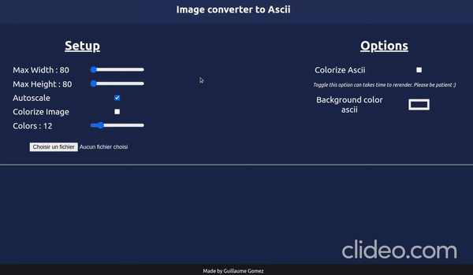

# Img => Ascii

This repository allows you to convert an image to an ascii image by conserving colors.

[Try Online](https://guillaume-gomez.github.io/image-to-ascii)

_based on [Jonathan Petitcolas article](https://www.jonathan-petitcolas.com/2017/12/28/converting-image-to-ascii-art.html)_

